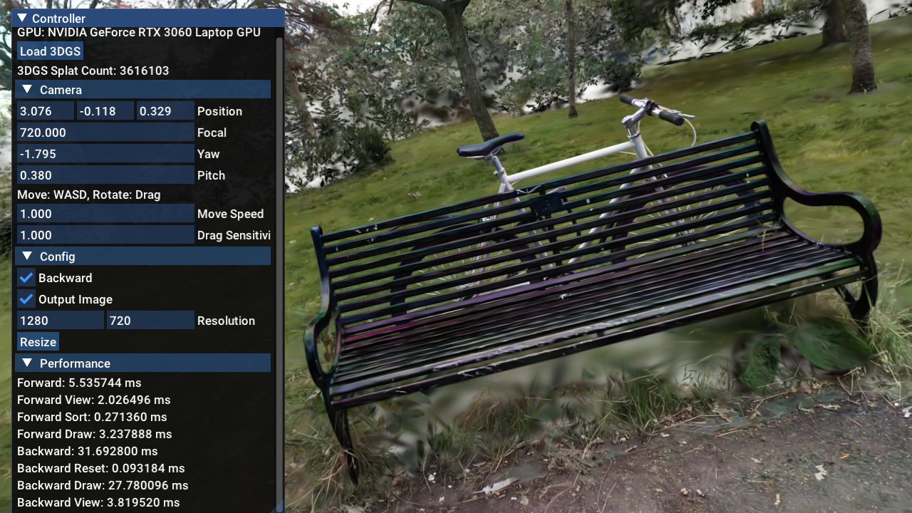

# VkDiffGaussianRasterizer

Reference implementation of ArXiv PrePrint paper: ["Efficient Differentiable Hardware Rasterization for 3D Gaussian Splatting"](https://arxiv.org/abs/2505.18764) by Yitian Yuan & Qianyue He. This paper was once a conference track submission for SIGGRAPH Asia 2025, yet **was unfortunately rejected**. Since neither of the authors still wants to continue working on 3DGS, the authors decided to make the repo open-sourced for everyone. So if you wish to cite, the following BibTex will do:
```
@article{yuan2025efficient,
  title={Efficient Differentiable Hardware Rasterization for 3D Gaussian Splatting},
  author={Yuan, Yitian and He, Qianyue},
  journal={arXiv preprint arXiv:2505.18764},
  year={2025}
}
```

#### Abstract
Recent works demonstrate the advantages of hardware rasterization for 3D Gaussian Splatting (3DGS) in forward-pass rendering through fast GPU-optimized graphics and fixed memory footprint. However, extending these benefits to backward-pass gradient computation remains challenging due to graphics pipeline constraints. We present a differentiable hardware rasterizer for 3DGS that overcomes the memory and performance limitations of tile-based software rasterization. Our solution employs programmable blending for per-pixel gradient computation combined with a hybrid gradient reduction strategy (quad-level + subgroup) in fragment shaders, achieving over 10x faster backward rasterization versus naive atomic operations and 3x speedup over the canonical tile-based rasterizer. Systematic evaluation reveals 16-bit render targets (float16 and unorm16) as the optimal accuracy-efficiency trade-off, achieving higher gradient accuracy among mixed-precision rendering formats with execution speeds second only to unorm8, while float32 texture incurs severe forward pass performance degradation due to suboptimal hardware optimizations. Our method with float16 formats demonstrates 3.07x acceleration in full pipeline execution (forward + backward passes) on RTX4080 GPUs with the MipNeRF dataset, outperforming the baseline tile-based renderer while preserving hardware rasterization's memory efficiency advantages -- incurring merely 2.67% of the memory overhead required for splat sorting operations. This work presents a unified differentiable hardware rasterization method that simultaneously optimizes runtime and memory usage for 3DGS, making it particularly suitable for resource-constrained devices with limited memory capacity.

#### Special Notes

The current NN frameworks like PyTorch and Paddle are not Vulkan friendly: PyTorch’s CUDA tensors lack the necessary shareable handle (via `cuMemExportToShareableHandle`) for seamless Vulkan memory sharing, since the allocation of memory is done by `cudaMalloc(Async)` instead of `cuMemCreate`. We therefore do not offer end-to-end 3DGS training modules, which was one of the main weaknesses criticized heavily by the reviewers. Yet we still note that our method offers promising avenues for reducing memory footprints and accelerating computation.

## External Libraries

- MyVK: My personal Vulkan abstraction library.

### For Testing

- [diff-gaussian-rasterization](https://github.com/graphdeco-inria/diff-gaussian-rasterization): The original 3DGS.
  tile-based rasterizer to be compared in `PerformanceTest`.
    - We use a modified version for better performance profiling.
- [nlohmann/json](https://github.com/nlohmann/json): To output gradient computation results in `PerformanceTest`.
- [stb_image_write](https://github.com/nothings/stb): To output rendering results in `PerformanceTest`.
- [tinyfiledialogs](https://sourceforge.net/projects/tinyfiledialogs/): For the file dialog in `RasterizerTest`.

> Some differentiation code in our rasterizer is generated with [Slang](https://github.com/shader-slang/slang)'s autodiff for convenience.

## How to Build

Same as other `CMake` projects.

### Dependencies

- A C++ compiler supporting C++20.
- `glslc`: GLSL compiler (included in VulkanSDK).
- `cuda`: For running tile-based rasterizers in `PerformanceTest` (Optional).

## How to Run

Download the [pre-trained 3DGS models (14 GB)](https://repo-sam.inria.fr/fungraph/3d-gaussian-splatting/datasets/pretrained/models.zip)
at [graphdeco-inria/gaussian-splatting](https://github.com/graphdeco-inria/gaussian-splatting).

### Configurations

- **Mixed-precision Format**: Edit the `PIXEL_T_FORMAT` macro in `shader/src/Rasterizer/Size.glsl`.
- **Balancing Threshold**: Edit the `BALANCING_THRESHOLD` macro in `shader/src/Rasterizer/BackwardDraw.frag`.

Recompile is needed after these changes (might need to recompile twice for MS Visual Studio, IDK Why).

### `RasterizerTest`



- Click `Load 3DGS` to load `.ply` 3DGS model file.
- WASD to move camera.
- Drag mouse to rotate camera.
- Check `Backward` to run backward pass and measure performance.

### `PerformanceTest`

```shell
./PerformanceTest [dataset filename]
  (-w=[width]) (-h=[height]) # Default to dataset resolution.
  (-i=[model iteration]) # Model iterations (7000 or 30000).
  (-s: single entry per scene) (-e=[entries per scene]) # For fast evaluation.
  (-w: write result) # Output rendering and gradient computation results (.png and .json).
  (-nocu) (-novk) # Ignore Vulkan (our method) or CUDA (tile-based) runs.
```

#### Dataset Format

A typical dataset for `PerformanceTest` can be a sub-directory in the pre-trained 3DGS model directory. For example:
```
bicycle/
├── cameras.json
├── input.ply
└── point_cloud
    ├── iteration_30000
    │   └── point_cloud.ply
    └── iteration_7000
        └── point_cloud.ply
```
can be tested with `./PerformanceTest path/to/bicycle`.

Or the dataset can be a text file containing all dataset directories' relative paths. For example file `mipnerf360.txt`
containing:
```
bicycle
garden
stump
counter
room
treehill
bonsai
kitchen
flowers
```
can be tested with `./PerformanceTest path/to/mipnerf360.txt`.

The training-iteration of pre-trained models to be tested can specified via `-i=7000/30000`, default to `7000`.

The rendering resolution can be specified via `-w=[width] -h=[height]`, default to the dataset's native image resolution (in `camera.json`).

To speedup evaluation, the number of camera entries per scene (in `camera.json`) to render can be specified via `-e=[entries per scene]`. Or simply selecting the first camera entry each scene cia `-s`

A typical output could be:

```
# Run with ./PerformanceTest /path/to/bicycle -s -i=7000
CUDA Device [0]: NVIDIA GeForce RTX 3060 Laptop GPU
gsDatasetMaxSplatCount: 3616103
gsDatasetMaxPixelCount: 16252556
model: /path/to/bicycle/point_cloud/iteration_7000/point_cloud.ply
splatCount = 3616103

bicycle 0/1 _DSC8679
CuBuffer::Update 0 -> 285688476
CuBuffer::Update 0 -> 260041184
CuBuffer::Update 0 -> 1982700159
CuBuffer::Update 0 -> 231430592
 vk_forward: 44.845056 ms
 vk_forward draw: 42.388480 ms
 vk_backward: 174.615552 ms
 vk_backward draw: 169.455616 ms
 vk: 219.460608 ms
 vk draw: 211.844096 ms
 cu_forward: 115.155586 ms
 cu_forward draw: 76.235779 ms
 cu_backward: 471.554077 ms
 cu_backward draw: 467.474335 ms
 cu: 586.709663 ms
 cu draw: 543.710114 ms
 speedup_forward: 2.567855
 speedup_forward draw: 1.798502
 speedup_backward: 2.700527
 speedup_backward draw: 2.758683
 speedup: 2.673417
 speedup draw: 2.566558
bicycle vk_forward: 44.845056 ms
bicycle vk_forward draw: 42.388480 ms
bicycle vk_backward: 174.615552 ms
bicycle vk_backward draw: 169.455616 ms
bicycle vk: 219.460608 ms
bicycle vk draw: 211.844096 ms
bicycle cu_forward: 115.155586 ms
bicycle cu_forward draw: 76.235779 ms
bicycle cu_backward: 471.554077 ms
bicycle cu_backward draw: 467.474335 ms
bicycle cu: 586.709663 ms
bicycle cu draw: 543.710114 ms
bicycle speedup_forward: 2.567855
bicycle speedup_forward draw: 1.798502
bicycle speedup_backward: 2.700527
bicycle speedup_backward draw: 2.758683
bicycle speedup: 2.673417
bicycle speedup draw: 2.566558
avg vk_forward: 44.845056 ms
avg vk_forward draw: 42.388480 ms
avg vk_backward: 174.615552 ms
avg vk_backward draw: 169.455616 ms
avg vk: 219.460608 ms
avg vk draw: 211.844096 ms
avg cu_forward: 115.155586 ms
avg cu_forward draw: 76.235779 ms
avg cu_backward: 471.554077 ms
avg cu_backward draw: 467.474335 ms
avg cu: 586.709663 ms
avg cu draw: 543.710114 ms
avg speedup_forward: 2.567855
avg speedup_forward draw: 1.798502
avg speedup_backward: 2.700527
avg speedup_backward draw: 2.758683
avg speedup: 2.673417
avg speedup draw: 2.566558
cu sortMem: 1982700159 = 1982700.159000 KB = 1982.700159 MB = 1.982700 GB
cu allMem: 2759860411 = 2759860.411000 KB = 2759.860411 MB = 2.759860 GB
vk sortMem: 61720216 = 61720.216000 KB = 61.720216 MB = 0.061720 GB
vk allMem: 784463064 = 784463.064000 KB = 784.463064 MB = 0.784463 GB
```

#### Result Output
Parameter `-w` can be used to output rendering and gradient computation results through PNG and JSON files, often combined with `-s` flag to prevent writing too many files.
